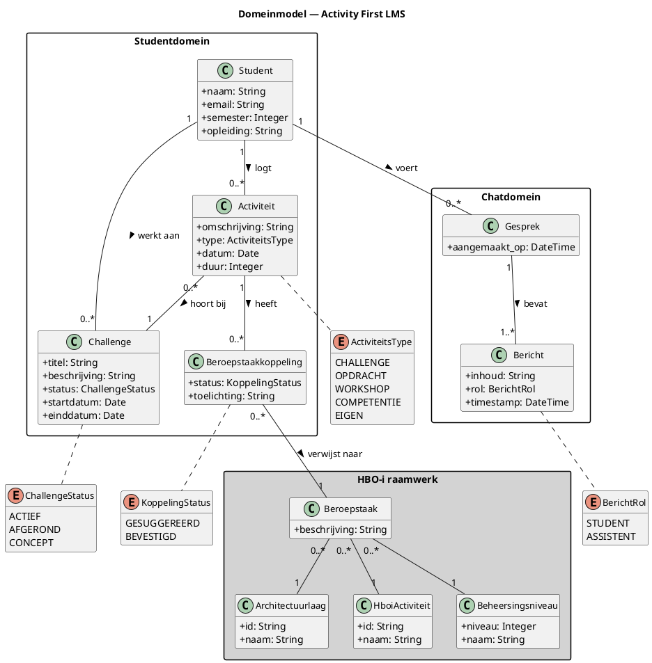

# Domeinanalyse — Activity First LMS

**Project:** Activity First LMS
**Student:** Jan van Hest | Semester 6 | HBO-ICT Open Learning | Fontys
**Sprint:** 2–3
**HBO-i:** Software × Analyseren × Niveau 3

Dit document doorloopt de volledige domeinanalyse van stap 1 tot en met stap 5: van ruwe termen uit de casus naar epics klaar voor implementatie.

---

## Stap 1 — Zelfstandige naamwoorden & werkwoorden

### Zelfstandige naamwoorden

Gevonden in het adviesrapport, het gespreksverslag met Eric Slaats en de probleemanalyse.

| Term | Bron |
|---|---|
| Student | Overal |
| Coach | Bijlage C, D |
| Docent | Bijlage D |
| Challenge | Bijlage C ("3 weken tot 3 jaar") |
| Semester | Bijlage C ("fluide onderwijs") |
| Activiteit | Concept B, C, D — jouw stramien |
| Activiteitstype | CHALLENGE / OPDRACHT / WORKSHOP / COMPETENTIE / EIGEN |
| Architectuurlaag | HBO-i raamwerk |
| HboiActiviteit | HBO-i raamwerk (analyseren, adviseren…) |
| Beheersingsniveau | HBO-i raamwerk (1–4) |
| Beroepstaak | Combinatie van bovenstaande drie |
| Leeruitkomst | Fontys-specifiek (LO1–LO7) |
| Cursusinhoud | Bijlage E — Canvas-pagina's voor RAG |
| Module | Canvas-structuur |
| Opdracht | Canvas, enquête |
| Workshop | Bijlage D (workshop-paradox) |
| Voortgang | Bijlage C, scoringscriterium C4 |
| Gesprek | Bijlage C ("dialoog aangaan") |
| Bericht | Onderdeel van gesprek |
| Nudge | Bijlage G |
| Leercyclus | Concept D (Stappenplan-tab) |
| Fase | Analyseren / Adviseren / Ontwerpen… |
| Portfolio | Portflow-context |
| Bewijsstuk | Portfolio-context |
| Profiel | Studentgegevens |
| Suggestie | Systeem stelt competentiekoppeling voor |

### Werkwoorden

| Werkwoord | Wie | Op wat |
|---|---|---|
| logt | Student | Activiteit |
| koppelt | Student / Systeem | Activiteit → Beroepstaak |
| suggereert | Systeem | Beroepstaakkoppeling |
| bevestigt | Student | Suggestie |
| stelt vraag | Student | Chatbot |
| zoekt | Student | Cursusinhoud |
| volgt | Student | Workshop |
| werkt aan | Student | Challenge |
| nastreeft | Student | Beroepstaak + Niveau |
| begeleidt | Coach | Student |
| monitort | Coach | Activiteiten van student |
| biedt aan | Coach / Docent | Workshop / Activiteit |
| indexeert | Systeem | Cursusinhoud |
| haalt op | Systeem | Studentcontext |
| genereert | Systeem | Antwoord |
| attendeert | Systeem | Student (nudge) |
| plant | Student | Activiteit |

---

## Stap 2 — Filter: entiteit, attribuut, rol of gedrag?

### Filtermethode

Elke term wordt langs vier vragen gelegd:

- **Entiteit**: heeft een eigen identiteit en levenscyclus, wordt opgeslagen. *Test: kan ik er twee van hebben die op elkaar lijken maar toch verschillend zijn?*
- **Attribuut**: beschrijft een entiteit, bestaat niet zonder die eigenaar. *Test: bestaat dit zonder zijn eigenaar? → nee = attribuut.*
- **Rol**: hetzelfde ding in een andere context. *Test: is dit eigenlijk een bekende entiteit met ander gedrag?*
- **Gedrag**: iets wat het systeem doet, geen ding dat het is. Komt uit de werkwoordenlijst.
- **Buiten scope**: bestaat in het domein maar wordt niet door dit systeem beheerd.

### Filterresultaat

| Term | Oordeel | Toelichting |
|---|---|---|
| Student | Entiteit | Heeft eigen identiteit, profiel, activiteiten en gesprekken |
| Coach | Rol | Is een gebruiker die studenten begeleidt — zelfde User, andere rechten |
| Docent | Rol | Is een gebruiker die workshops aanbiedt — zelfde User, andere rechten |
| Challenge | Entiteit | Heeft naam, status, looptijd, hoort bij één student |
| Semester | Attribuut | Beschrijft een Student (huidig semester), geen eigen levenscyclus |
| Activiteit | Entiteit | Heeft type, datum, duur, koppeling aan challenge en beroepstaken |
| Activiteitstype | Attribuut | Enum op Activiteit: CHALLENGE / OPDRACHT / WORKSHOP / COMPETENTIE / EIGEN |
| Architectuurlaag | Entiteit (referentie) | Vaste lijst uit HBO-i raamwerk, wordt niet aangemaakt door gebruiker |
| HboiActiviteit | Entiteit (referentie) | Vaste lijst: analyseren t/m manage & control |
| Beheersingsniveau | Entiteit (referentie) | Vaste lijst: 1–4 met naam en beschrijving |
| Beroepstaak | Entiteit (referentie) | Combinatie van architectuurlaag + activiteit + niveau — hart van het raamwerk |
| Leeruitkomst | Buiten scope (PoC) | Fontys-specifiek, niet op de HBO-i server, te complex voor PoC |
| Cursusinhoud | Buiten scope (domein) | Gebruiker ervaart dit niet direct — leeft als technisch concept (Chunk) in de RAG-pipeline, niet in het domein |
| Module | Buiten scope (structuur) | Canvas-navigatiestructuur valt buiten scope — inhoud wordt technisch geïndexeerd maar leeft niet in het domein |
| Opdracht | Buiten scope | Canvas-concept, valt buiten systeemgrens |
| Workshop | Attribuut / Activiteitstype | Als activiteitstype is het een enum-waarde; als Coach een workshop *aanbiedt* is het een Activiteit van het type WORKSHOP |
| Voortgang | Gedrag / Berekend | Geen entiteit — wordt afgeleid uit gelogde activiteiten en beroepstaakkoppelingen |
| Gesprek | Entiteit | Heeft een eigen levenscyclus per student, bevat berichten |
| Bericht | Entiteit | Onderdeel van gesprek, heeft rol (student/assistent), inhoud en timestamp |
| Nudge | Gedrag | Het systeem *attendeert* — dat is gedrag, geen ding dat wordt opgeslagen |
| Leercyclus | Buiten scope (PoC) | Informatief concept in de Stappenplan-tab, geen eigen data |
| Fase | Attribuut | Mogelijke enum op Challenge (in welke fase zit je?), niet verplicht voor PoC |
| Portfolio | Buiten scope | Portflow beheert dit, niet dit systeem |
| Bewijsstuk | Buiten scope | Hoort bij Portflow / portfolio, niet bij dit systeem |
| Profiel | Attribuut | Beschrijft Student (naam, email, semester) — geen aparte entiteit nodig |
| Suggestie | Gedrag | Het systeem *suggereert* een koppeling — dat is gedrag, de koppeling zelf is de entiteit |

---

## Uitkomst

Na filtering blijven de volgende **echte entiteiten** over:

- Student
- Challenge
- Activiteit
- Beroepstaak *(referentie — vaste HBO-i lijst)*
- Architectuurlaag *(referentie)*
- HboiActiviteit *(referentie)*
- Beheersingsniveau *(referentie)*
- Beroepstaakkoppeling *(koppeltabel tussen Activiteit en Beroepstaak)*
- Gesprek
- Bericht

De volgende termen worden **rollen**:

- Coach (= User met coachrechten)
- Docent (= User met docentrechten)

De volgende termen vallen **buiten scope** voor de PoC:

- Module, Opdracht, Portfolio, Bewijsstuk, Leeruitkomst, Leercyclus, Cursusinhoud

> **Technische noot:** `Chunk` leeft niet in het domein maar wel in de technische architectuur — het is het opslagformaat van de RAG-pipeline. Hoort thuis in het datamodel en de C4-diagrammen, niet hier.

---

---

# Stap 3 — Domeinmodel

**Project:** Activity First LMS  
**Student:** Jan van Hest | Semester 6 | HBO-ICT Open Learning | Fontys  
**Sprint:** 2–3  
**Doel van dit document:** Domeinmodel op basis van de gefilterde entiteiten uit stap 2. Beschrijft klassen, attributen en relaties zoals de gebruiker die ervaart — geen technische implementatiedetails.

---

## Klassendiagram (PlantUML)



---

## Toelichting per klasse

### Studentdomein

**Student** — de centrale gebruiker. Heeft een profiel (naam, email, semester, opleiding). Logt activiteiten, werkt aan challenges en voert gesprekken met de chatbot.

**Challenge** — het project of de opdracht waar een student aan werkt. Heeft een status (concept, actief, afgerond) en een looptijd. Eén student kan meerdere challenges hebben, maar werkt doorgaans aan één actieve.

**Activiteit** — een concrete leerhandeling gelogd door de student. Het type bepaalt de aard: CHALLENGE (werken aan een challenge), OPDRACHT (een formele opdracht), WORKSHOP (bijwonen of geven), COMPETENTIE (gericht aantonen van een beroepstaak), EIGEN (vrij formaat). Elke activiteit hoort bij één challenge.

**Beroepstaakkoppeling** — de verbinding tussen een activiteit en een beroepstaak uit het HBO-i raamwerk. Kan gesuggereerd zijn door het systeem of bevestigd door de student. De toelichting is de eigen onderbouwing van de student: "dit toont aan omdat..."

### HBO-i raamwerk

Dit package bevat **referentiedata** — vaste lijsten die niet door gebruikers worden aangemaakt maar door het systeem worden geladen (via de HBO-i server of seed-data).

**Beroepstaak** — de atomaire eenheid van het HBO-i raamwerk. Altijd een combinatie van architectuurlaag + activiteit + beheersingsniveau. Bijvoorbeeld: Software × Realiseren × Niveau 3.

**Architectuurlaag** — Software, Infrastructuur, Gebruikersinteractie, Organisatieprocessen, Hardware interfacing.

**HboiActiviteit** — Analyseren, Adviseren, Ontwerpen, Realiseren, Manage & Control.

**Beheersingsniveau** — 1 (taakgericht), 2 (probleemgericht), 3 (situatiegericht), 4 (professiegericht).

### Chatdomein

**Gesprek** — een chatsessie van een student met de assistent. Heeft een eigen levenscyclus en bevat één of meer berichten.

**Bericht** — één uitwisseling in een gesprek. De rol bepaalt wie het bericht heeft gestuurd: de student of de assistent.

---

## Ontwerpkeuzes

**Waarom geen aparte User-klasse?**
Voor de PoC is alleen de Student als actieve gebruiker in scope. Coach en Docent zijn rollen die later als uitbreiding op User kunnen worden toegevoegd. Nu een aparte hiërarchie bouwen voegt complexiteit toe zonder PoC-waarde.

**Waarom Beroepstaakkoppeling als aparte klasse?**
Omdat de koppeling zelf attributen heeft (status, toelichting). Een simpele many-to-many relatie tussen Activiteit en Beroepstaak zou die informatie kwijtraken.

**Waarom Chunk niet in het domein?**
Chunk is een technisch implementatiedetail van de RAG-pipeline. De gebruiker ervaart cursusinhoud via de chatbot, niet als directe entiteit. Chunk leeft in het datamodel en de architectuur.

**Waarom HboiActiviteit en niet Activiteit?**
Om naamconflict te vermijden. De student logt een `Activiteit` (zijn eigen leerhandeling). Het HBO-i raamwerk kent ook een `Activiteit` (analyseren, adviseren etc.). Twee verschillende concepten, één woord — vandaar `HboiActiviteit` in de code.

---

---

# Stap 4 — Requirements & acceptatiecriteria

**Project:** Activity First LMS  
**Student:** Jan van Hest | Semester 6 | HBO-ICT Open Learning | Fontys  
**Sprint:** 3  
**HBO-i:** Software × Analyseren × Niveau 3  
**Beroepstaak:** Uitvoeren van een requirements-analyse voor een softwaresysteem met verschillende stakeholders in een context van bestaande systemen. Definiëren van acceptatiecriteria aan de hand van kwaliteitseigenschappen.

---

## Stakeholders

| Stakeholder | Belang |
|---|---|
| Student (avondopleiding HBO-ICT) | Activiteiten loggen, beroepstaken koppelen, chatbot raadplegen |
| Eric Slaats (Digital Transformer, Fontys) | Canvas blijft intact, tool sluit aan op vraaggestuurd onderwijs, nudging |
| Coach | Inzicht in voortgang student zonder handmatig monitoren |

---

## Context van bestaande systemen

Dit systeem integreert met:

- **Canvas LMS** — bron van gebruikersidentiteit via LTI 1.3, cursusinhoud via REST API
- **HBO-i raamwerk** — vaste referentiedata voor architectuurlagen, activiteiten en beheersingsniveaus
- **Portflow** — voorbeeld van LTI Global Navigation Placement bij Fontys (integratieparadigma)
- **Anthropic API** — taalmodel voor chatbot

---

## Functionele requirements

### FR-01 — Activiteit aanmaken

Het systeem stelt een student in staat een activiteit aan te maken met een type, omschrijving, datum en koppeling aan een actieve challenge.

**Acceptatiecriteria:**
- Een activiteit heeft een verplicht type uit de enum: CHALLENGE, OPDRACHT, WORKSHOP, COMPETENTIE, EIGEN
- Een activiteit is altijd gekoppeld aan één challenge
- Een activiteit zonder type of challenge wordt geweigerd met een foutmelding

---

### FR-02 — Beroepstaak koppelen aan activiteit

Het systeem stelt een student in staat een beroepstaak te koppelen aan een activiteit, met een status (gesuggereerd of bevestigd) en een optionele toelichting.

**Acceptatiecriteria:**
- Een koppeling verwijst naar een geldige beroepstaak (architectuurlaag + activiteit + niveau)
- Status gesuggereerd mag zonder toelichting worden opgeslagen
- Status bevestigd vereist een toelichting van minimaal één zin
- Een activiteit mag meerdere beroepstaakkoppelingen hebben

---

### FR-03 — Challenge aanmaken en beheren

Het systeem stelt een student in staat een challenge aan te maken, te activeren en af te ronden.

**Acceptatiecriteria:**
- Een challenge heeft een titel, beschrijving en status (concept, actief, afgerond)
- Een student heeft maximaal één challenge met status actief tegelijk
- Een afgeronde challenge kan niet opnieuw worden geactiveerd

---

### FR-04 — Chatbot raadplegen

Het systeem stelt een student in staat een vraag te stellen aan de chatbot, die antwoord geeft op basis van cursusinhoud en de studentcontext.

**Acceptatiecriteria:**
- De chatbot heeft toegang tot de actieve challenge, recente activiteiten en gekoppelde beroepstaken van de student
- Antwoorden zijn gebaseerd op geïndexeerde cursusinhoud (RAG) en studentcontext
- De gespreksgeschiedenis wordt per student bewaard
- De chatbot antwoordt binnen 10 seconden onder normale omstandigheden

---

### FR-05 — Studentprofiel via LTI

Het systeem haalt de gebruikersidentiteit op via LTI 1.3 bij elke launch vanuit Canvas.

**Acceptatiecriteria:**
- Naam, email en Canvas-gebruikers-id worden opgeslagen bij eerste launch
- Een student hoeft niet apart in te loggen
- Bij herhaalde launch wordt het bestaande profiel opgehaald, niet opnieuw aangemaakt

---

### FR-06 — Activiteitenoverzicht bekijken

Het systeem toont een student een chronologisch overzicht van zijn gelogde activiteiten, gegroepeerd per challenge.

**Acceptatiecriteria:**
- Overzicht toont type, omschrijving, datum en eventuele beroepstaakkoppelingen per activiteit
- Overzicht is filterbaar op challenge
- Activiteiten zonder beroepstaakkoppeling zijn visueel onderscheidbaar

---

### FR-07 — Beroepstaaksuggestie ontvangen

Het systeem suggereert automatisch een of meer beroepstaken na het aanmaken van een activiteit, op basis van het activiteitstype en de actieve challenge.

**Acceptatiecriteria:**
- Suggestie bevat architectuurlaag, activiteit en beheersingsniveau
- Student kan een suggestie bevestigen (met toelichting) of afwijzen
- Afwijzen verwijdert de suggestie zonder verdere actie
- Suggestie wordt niet gegenereerd als er geen actieve challenge is

---

### FR-08 — Gespreksgeschiedenis bekijken

Het systeem toont een student zijn eerdere gesprekken met de chatbot.

**Acceptatiecriteria:**
- Gesprekken zijn gesorteerd op datum, meest recent eerst
- Een eerder gesprek kan worden heropend en voortgezet
- Gespreksgeschiedenis is alleen zichtbaar voor de eigen student

---

### FR-09 — Coach ziet activiteiten van student

Het systeem toont een coach een overzicht van de activiteiten van zijn studenten.

**Acceptatiecriteria:**
- Coach ziet per student: naam, actieve challenge, aantal gelogde activiteiten
- Coach kan doorklikken naar het activiteitenoverzicht van een individuele student
- Coach ziet alleen studenten die aan hem zijn gekoppeld

---

### FR-10 — Coach voegt activiteit toe aan student

Het systeem stelt een coach in staat een activiteit toe te voegen aan de tijdlijn van een student, bijvoorbeeld een aangeboden workshop.

**Acceptatiecriteria:**
- Coach kan een activiteit aanmaken namens een student
- De activiteit is zichtbaar in het overzicht van de student
- De student ontvangt een melding van de toegevoegde activiteit

---

### FR-11 — Cursusinhoud indexeren

Het systeem indexeert geselecteerde cursusinhoud in de vector database zodat de chatbot er vragen over kan beantwoorden.

**Acceptatiecriteria:**
- Indexering wordt uitgevoerd via een seed-taak, niet automatisch bij elke launch
- Geïndexeerde inhoud bevat een bron-label (bijv. titel van de Canvas-pagina)
- Herindexeren overschrijft bestaande chunks voor dezelfde bron

---

### FR-12 — Nudge bij inactiviteit

Het systeem attendeert een student wanneer hij langere tijd geen activiteiten heeft gelogd.

**Acceptatiecriteria:**
- Nudge verschijnt na X dagen inactiviteit (standaard: 7 dagen, instelbaar)
- Nudge is zichtbaar bij het openen van de applicatie, niet als externe notificatie
- Student kan een nudge wegklikken zonder verdere actie

---

## Niet-functionele requirements

### NFR-01 — Performance

Het systeem reageert op gebruikersacties binnen aanvaardbare tijd.

**Acceptatiecriteria:**
- REST-endpoints (activiteiten, challenges, profiel) responderen binnen 500ms
- Chatbot genereert een eerste token binnen 3 seconden
- Vectorzoekopdrachten (RAG retrieval) worden uitgevoerd binnen 1 seconde

---

### NFR-02 — Privacy (AVG)

Het systeem verwerkt persoonsgegevens van studenten conform de AVG.

**Acceptatiecriteria:**
- Embeddings worden lokaal gegenereerd via Ollama — geen studentdata naar externe embedding-API's
- Gespreksgeschiedenis wordt alleen opgeslagen voor de eigen student, niet gedeeld
- Studentdata wordt niet opgenomen in URL-parameters of querystrings
- Voor productie: verwerkersovereenkomst met Anthropic vereist (buiten PoC-scope, wel gedocumenteerd als risico)

---

### NFR-03 — Security

Het systeem is uitsluitend toegankelijk via geldige LTI-launch.

**Acceptatiecriteria:**
- Alle API-endpoints vereisen een geldig sessie-token afgeleid van de LTI-launch
- LTI JWT wordt gevalideerd met de Canvas public key
- Geen endpoints zijn publiek toegankelijk zonder authenticatie

---

### NFR-04 — Duurzaamheid

Het systeem minimaliseert onnodige externe API-aanroepen.

**Acceptatiecriteria:**
- Embeddings worden lokaal gegenereerd (Ollama) — geen kosten of externe afhankelijkheid voor indexering
- Cursusinhoud wordt eenmalig geïndexeerd, niet bij elke chatbotaanroep opnieuw opgehaald
- Anthropic API wordt alleen aangeroepen bij een daadwerkelijke chatvraag

---

### NFR-05 — Toegankelijkheid

De interface is bruikbaar voor avondstudenten op uiteenlopende apparaten.

**Acceptatiecriteria:**
- De applicatie is bruikbaar op een modern mobiel apparaat (responsive layout)
- Kleurcontrast voldoet aan WCAG 2.1 AA
- Formulieren zijn bedienbaar via toetsenbord

---

## Risicoanalyse (top 3)

| # | Risico | Kans | Impact | Mitigatie |
|---|---|---|---|---|
| R1 | Anthropic API-kosten lopen op bij intensief testgebruik | Laag | Middel | Gebruikslimiet instellen via Anthropic dashboard; PoC beperkt tot kleine testgroep |
| R2 | Studentdata lekt via chatbot-antwoorden naar andere gebruikers | Laag | Hoog | Sessie-isolatie per student afdwingen; gespreksgeschiedenis nooit gedeeld |
| R3 | LTI-configuratie bij Fontys Canvas vereist beheerderstoegang | Middel | Hoog | Eric Slaats heeft developer keys toegezegd; tijdig afstemmen voor sprint 3 |

---

## MoSCoW — PoC scope

| FR | Requirement | MoSCoW | Reden |
|---|---|---|---|
| FR-01 | Activiteit aanmaken | Must | Kern van het systeem — zonder dit geen data |
| FR-02 | Beroepstaak koppelen | Must | Primaire waarde voor student — competentiekoppeling |
| FR-03 | Challenge aanmaken en beheren | Must | Context voor activiteiten — zonder challenge geen activiteit |
| FR-04 | Chatbot raadplegen | Must | Kern van Concept D — RAG + studentcontext |
| FR-05 | Studentprofiel via LTI | Must | Toegangspoort — zonder LTI werkt niets |
| FR-06 | Activiteitenoverzicht | Must | Student moet zien wat hij gelogd heeft |
| FR-07 | Beroepstaaksuggestie | Should | Waardevol maar chatbot kan dit deels overnemen |
| FR-08 | Gespreksgeschiedenis | Should | Nuttig maar niet blokkerend voor PoC-validatie |
| FR-09 | Coach ziet studenten | Could | Coach buiten PoC-scope volgens C4 Level 1 |
| FR-10 | Coach voegt activiteit toe | Could | Afhankelijk van FR-09 |
| FR-11 | Cursusinhoud indexeren | Must | RAG werkt niet zonder geïndexeerde inhoud |
| FR-12 | Nudge bij inactiviteit | Won't | Waardevol concept, te vroeg voor PoC |

---

---

# Stap 5 — Epics

**Project:** Activity First LMS
**Student:** Jan van Hest | Semester 6 | HBO-ICT Open Learning | Fontys
**Sprint:** 3
**Basis:** Must-requirements uit stap 4 (FR-01, FR-02, FR-03, FR-04, FR-05, FR-06, FR-11)

---

## Overzicht

| Epic | Naam | FR's |
|---|---|---|
| E-01 | Toegang via Canvas | FR-05 |
| E-02 | Challenge beheren | FR-03 |
| E-03 | Activiteiten bijhouden | FR-01, FR-06 |
| E-04 | Beroepstaken koppelen | FR-02 |
| E-05 | Chatbot met context | FR-04, FR-11 |

---

## E-01 — Toegang via Canvas

Een student opent de applicatie vanuit Canvas via LTI Global Navigation. Het systeem herkent de student en maakt indien nodig een profiel aan. Geen apart inloggen.

**FR's:** FR-05
**Afhankelijkheden:** Canvas developer key (Eric Slaats), LTI 1.3 configuratie

---

## E-02 — Challenge beheren

Een student maakt een challenge aan, activeert hem en rondt hem af. De actieve challenge vormt de context voor alle activiteiten en de chatbot.

**FR's:** FR-03
**Afhankelijkheden:** E-01 (student moet bekend zijn)

---

## E-03 — Activiteiten bijhouden

Een student logt wat hij heeft gedaan — een workshop gevolgd, een opdracht geschreven, aan zijn challenge gewerkt. Hij ziet een overzicht van alles wat hij gelogd heeft.

**FR's:** FR-01, FR-06
**Afhankelijkheden:** E-01, E-02

---

## E-04 — Beroepstaken koppelen

Een student koppelt een beroepstaak aan een activiteit en legt vast wat hij daarmee aantoont. De koppeling verwijst naar een specifieke combinatie van architectuurlaag, activiteit en beheersingsniveau uit het HBO-i raamwerk.

**FR's:** FR-02
**Afhankelijkheden:** E-03, HBO-i referentiedata geladen

---

## E-05 — Chatbot met context

Een student stelt een vraag aan de chatbot. De chatbot weet aan welke challenge de student werkt, welke activiteiten hij heeft gelogd en welke beroepstaken hij nastreeft. Antwoorden zijn gebaseerd op geïndexeerde cursusinhoud.

**FR's:** FR-04, FR-11
**Afhankelijkheden:** E-01, E-02, E-03, cursusinhoud geïndexeerd

---

## Volgorde van implementatie

```
E-01 → E-02 → E-03 → E-04
                  ↘
                   E-05
```

E-05 heeft alle voorgaande epics nodig voor een zinvolle studentcontext. E-04 en E-05 kunnen parallel lopen zodra E-03 klaar is.

---

# Architecture Decision Records

---

## ADR-01 — NestJS als backend framework

**Status:** Geaccepteerd

**Context:**
De backend moet een REST API exposeren, een RAG-pipeline orkestreren, tool calls afhandelen en integreren met PostgreSQL, Ollama en de Anthropic API. Er is een keuze nodig voor een Node.js framework.

**Beslissing:**
NestJS met TypeScript.

**Alternatieven overwogen:**
- Fastify / Hono — lichter en sneller, maar minder structuur voor een multi-module applicatie
- Express — te minimalistisch, vereist veel handmatige opzet voor dependency injection en modules
- Python (FastAPI) — sterke ML-integraties maar het team werkt primair in TypeScript

**Consequenties:**
- Module-gebaseerde structuur sluit direct aan op het domeinmodel (één module per entiteit)
- Dependency injection maakt testbaarheid eenvoudiger
- Decorators en guards zijn herbruikbaar voor LTI-authenticatie later

---

## ADR-02 — PostgreSQL + pgvector als database

**Status:** Geaccepteerd

**Context:**
De applicatie heeft twee soorten data nodig: relationele data (studenten, activiteiten, challenges, beroepstaken) en vectordata (embeddings voor RAG). Er is een keuze nodig voor één of twee databases.

**Beslissing:**
PostgreSQL 16 met de pgvector extensie voor beide datatypen.

**Alternatieven overwogen:**
- Pinecone — managed vector DB, maar externe service met kosten en AVG-risico (studentdata naar buiten)
- Chroma — lokale vector DB, maar aparte service naast PostgreSQL; twee databases voor een PoC is overkill
- Supabase — PostgreSQL + pgvector als managed service, maar onnodige cloud-afhankelijkheid voor PoC

**Consequenties:**
- Één database voor alles — simpelere Docker Compose setup
- Vectorzoekopdrachten via SQL — geen aparte client library nodig
- pgvector ondersteunt 768-dimensionele vectors van nomic-embed-text

---

## ADR-03 — Ollama + nomic-embed-text voor lokale embeddings

**Status:** Geaccepteerd

**Context:**
RAG vereist het omzetten van tekst naar vectorrepresentaties (embeddings). Er is een keuze nodig voor een embedding model en hoe dat wordt aangeroepen.

**Beslissing:**
Ollama lokaal draaien met het model `nomic-embed-text` (768 dimensies).

**Alternatieven overwogen:**
- OpenAI text-embedding-3-small — externe API, kosten per token, studentdata verlaat het systeem (AVG-risico)
- Voyage-3 (Anthropic) — zelfde bezwaren als OpenAI
- sentence-transformers (Python) — goed model maar vereist Python runtime naast Node.js

**Consequenties:**
- Geen kosten voor indexering
- Studentdata verlaat het systeem niet bij embeddings — AVG-compliant
- Ollama draait als aparte service in Docker Compose op de hostmachine
- Latentie iets hoger dan cloud-embeddings, acceptabel voor PoC

---

## ADR-04 — Claude Sonnet via Anthropic API als taalmodel

**Status:** Geaccepteerd

**Context:**
De chatbot heeft een taalmodel nodig voor het genereren van antwoorden op basis van retrieval context en studentcontext.

**Beslissing:**
Claude Sonnet via de Anthropic API (`claude-sonnet-4-20250514`).

**Alternatieven overwogen:**
- GPT-4o (OpenAI) — vergelijkbare kwaliteit, maar OpenAI heeft instabiele Custom GPT rollouts laten zien (Ars Technica, aug 2025)
- Lokaal model via Ollama — onvoldoende kwaliteit voor complexe redenering over HBO-i competenties op beschikbare hardware

**Consequenties:**
- Kosten ~$3/M input tokens, $15/M output tokens — verwaarloosbaar voor PoC
- Voor productie: verwerkersovereenkomst met Anthropic vereist vanwege studentdata in prompts
- API-sleutel beheren via environment variabele, nooit in code

---

## ADR-05 — LTI Global Navigation Placement als Canvas-integratie

**Status:** Geaccepteerd

**Context:**
De tool moet integreren met Canvas LMS zodat studenten er naadloos gebruik van kunnen maken. Er zijn twee LTI-integratiemogelijkheden bij Fontys in gebruik.

**Beslissing:**
LTI 1.3 Global Navigation Placement — de tool verschijnt als item in het vaste Canvas-navigatiemenu en opent als volledige webapplicatie.

**Alternatieven overwogen:**
- Course Navigation (zoals FeedPulse) — alleen zichtbaar binnen een specifieke cursus; niet geschikt want de tool is niet cursusgebonden
- iframe embedding — beperkt door third-party cookie-problemen in moderne browsers

**Consequenties:**
- Tool altijd bereikbaar ongeacht welke cursus open is — zoals Portflow
- Geen iframe-beperkingen
- Canvas blijft volledig intact — backwards compatible
- Vereist developer key van Canvas-beheerder (Eric Slaats heeft dit toegezegd)

---

## ADR-06 — Mock-authenticatie voor PoC

**Status:** Geaccepteerd

**Context:**
LTI 1.3 implementeren vereist een Canvas developer key, een geregistreerde tool en een volledige OpenID Connect flow. Voor de PoC is dit te veel overhead — het vertraagt validatie van de kernfunctionaliteit.

**Beslissing:**
Een NestJS `MockAuthGuard` die in development-mode een hardcoded studentprofiel injecteert alsof het een geldige LTI-launch was. In productie wordt de guard vervangen door een `LtiAuthGuard` met dezelfde interface.

**Alternatieven overwogen:**
- Echte LTI-implementatie vanaf het begin — correct maar blokkeert PoC-validatie weken
- Geen authenticatie — onveilig en geeft geen realistisch beeld van de uiteindelijke flow

**Consequenties:**
- PoC kan draaien zonder Canvas-koppeling
- Guard-interface is identiek aan de productie-implementatie — swap later zonder andere code te wijzigen
- Risico: LTI-integratie blijft een openstaand punt voor sprint 4

---

## ADR-07 — HBO-i referentiedata als database seed

**Status:** Geaccepteerd

**Context:**
De chatbot en het activiteitenpanel hebben beroepstaken, architectuurlagen, activiteiten en beheersingsniveaus nodig uit het HBO-i raamwerk. Er is een keuze nodig hoe deze data beschikbaar wordt gemaakt.

**Beslissing:**
HBO-i referentiedata eenmalig laden als seed via een NestJS migratie. De data wordt geëxporteerd uit de bestaande HBO-i MCP server en opgeslagen in PostgreSQL.

**Alternatieven overwogen:**
- HBO-i MCP server als Docker service — MCP is ontworpen voor AI-client communicatie, niet voor server-to-server; verkeerde laag voor een NestJS backend
- Live HTTP calls naar MCP server per request — onnodige netwerkafhankelijkheid voor statische data
- Hardcoded in TypeScript — niet onderhoudbaar, moeilijk te updaten

**Consequenties:**
- Geen runtime-afhankelijkheid van externe services voor referentiedata
- Data is querybaar via SQL — eenvoudig te filteren voor tool calls
- Bij update van het HBO-i raamwerk: nieuw seed-bestand genereren en migratie uitvoeren
- MCP server blijft beschikbaar voor Claude.ai gesprekken — andere use case, geen conflict

---

## ADR-08 — Tool use (function calling) voor dynamische studentdata in chatbot

**Status:** Geaccepteerd

**Context:**
De chatbot moet kunnen antwoorden op vragen over dynamische studentdata zoals "welke activiteiten heb ik deze week gedaan?" of "welke beroepstaken heb ik al gekoppeld?". RAG is hiervoor niet geschikt — RAG zoekt in statische tekst, niet in databaserecords.

**Beslissing:**
Anthropic tool use (ook wel function calling). De backend definieert functies die Claude kan aanroepen — zoals `get_activities` en `get_beroepstaakkoppelingen`. Claude beslist zelf wanneer een tool nodig is, de backend voert de query uit en geeft het resultaat terug in de context.

**Alternatieven overwogen:**
- Altijd volledige context meesturen in systeem-prompt — werkt voor kleine datasets maar schaalt slecht; privacy-risico bij grote datasets
- RAG op activiteiten — verkeerde techniek; RAG is voor semantisch zoeken in tekst, niet voor gestructureerde queries

**Consequenties:**
- Claude roept alleen data op die relevant is voor de vraag — efficiënter dan alles meesturen
- Nieuwe tools toevoegen zonder de chatbot-architectuur te wijzigen
- Iets complexere backend-logica voor het afhandelen van tool call responses
- Hetzelfde patroon werkt later voor coach-functionaliteit

---

## ADR-09 — GitHub Container Registry voor HBO-i MCP server image

**Status:** Geaccepteerd

**Context:**
De HBO-i MCP server is een apart project op GitHub. Teamleden en de CI/CD pipeline moeten hem kunnen gebruiken zonder de broncode lokaal te hoeven bouwen.

**Beslissing:**
GitHub Actions bouwt automatisch een Docker image bij elke push naar main en publiceert die naar GitHub Container Registry (ghcr.io). Gratis voor publieke repositories. De `GITHUB_TOKEN` is automatisch beschikbaar — geen extra secrets nodig.

**Alternatieven overwogen:**
- Docker Hub — ook gratis voor publieke images maar ghcr.io zit al in het GitHub-ecosysteem
- Git submodule — broncode in repo opnemen; meer overhead voor teamleden
- npm package — vereist publiceren naar registry; overkill voor een Docker-service

**Consequenties:**
- Eén `docker-compose pull` haalt de laatste versie op
- CI/CD pipeline als infra-bewijsstuk voor Manage & Control / Infrastructuur / N1
- GITHUB_TOKEN is automatisch beschikbaar — geen extra secrets nodig
- Image wordt publiek — geen gevoelige data in de MCP server zetten

---

## Overzicht

| ADR | Beslissing | Status |
|---|---|---|
| ADR-01 | NestJS als backend framework | Geaccepteerd |
| ADR-02 | PostgreSQL + pgvector als database | Geaccepteerd |
| ADR-03 | Ollama + nomic-embed-text voor embeddings | Geaccepteerd |
| ADR-04 | Claude Sonnet via Anthropic API | Geaccepteerd |
| ADR-05 | LTI Global Navigation Placement | Geaccepteerd |
| ADR-06 | Mock-authenticatie voor PoC | Geaccepteerd |
| ADR-07 | HBO-i referentiedata als database seed | Geaccepteerd |
| ADR-08 | Tool use voor dynamische studentdata | Geaccepteerd |
| ADR-09 | GitHub Container Registry voor HBO-i MCP image | Geaccepteerd |
