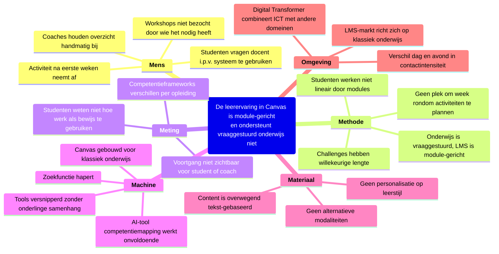

# Ishikawa-diagram (6M) - Oorzaakanalyse kernprobleem

## Kernprobleem

> De leerervaring in Canvas is module-gericht en ondersteunt vraaggestuurd onderwijs niet.

## Toelichting per categorie

### Mens

Studenten gebruiken het systeem niet zoals bedoeld. Ze vragen de docent in plaats van zelf te zoeken, bezoeken workshops niet (terwijl ze er wel om vragen), en de activiteit neemt af na de eerste weken. Coaches moeten handmatig overzicht houden over waar studenten mee bezig zijn.

### Methode

Het onderwijs beweegt richting vraaggestuurd, maar het LMS is ingericht rondom vaste modules en cursussen. Studenten schakelen tussen activiteiten, feedbackmomenten en persoonlijke leerdoelen. Challenges varieren van 3 weken tot 3 jaar. Er is geen plek om de eigen week rondom activiteiten te organiseren.

### Meting

Competentieframeworks verschillen per opleiding (HBO-ICT gebruikt 5 competenties, Digital Transformer 4). Studenten weten niet hoe ze hun werkzaamheden kunnen koppelen aan competenties. Voortgang is niet inzichtelijk voor student of coach.

### Machine

Canvas is gebouwd voor klassiek onderwijs met vaste vakken. De zoekfunctie werkt slecht. Het ecosysteem bestaat uit losse tools (FeedPulse, portfolio, Fontys Links, Studycoach) zonder samenhang. Er is een AI-tool voor competentiemapping, maar die spuugt te veel tekst uit en wordt daardoor weinig gebruikt.

### Materiaal

Content in courses is overwegend tekst-gebaseerd, terwijl studenten steeds slechter lezen. Er zijn geen alternatieve modaliteiten (audio, video, animatie, dialoog). De ervaring is voor iedereen hetzelfde - er is geen personalisatie op basis van leerstijl of sturingsbehoefte.

### Omgeving

De LMS-markt richt zich op klassiek onderwijs - vraaggestuurd is nog een niche. De Digital Transformer combineert ICT met andere domeinen, wat extra eisen stelt aan het platform. Dagschoolstudenten en avondstudenten opereren fundamenteel anders qua contactintensiteit en coaching.
